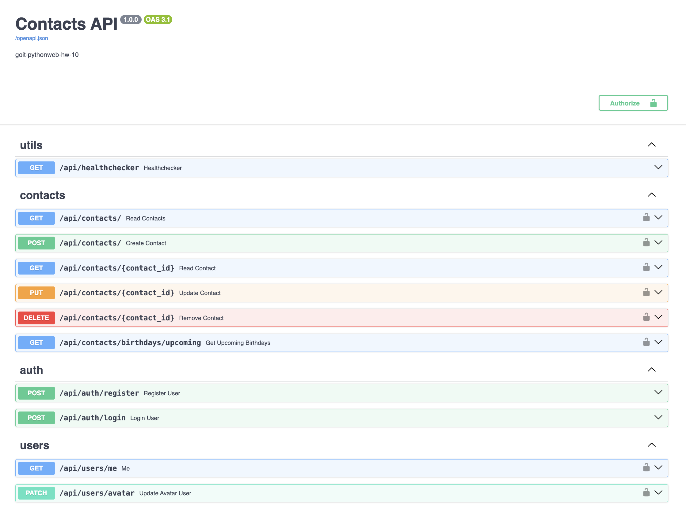

# goit-pythonweb-hw-12

В даному проекті реалізовано REST API додаток з використанням багаторівневої
архітектури 

## Стек

- Python 3.11
- FastAPI
- PostgreSQL
- ORM SQLAlchemy
- Alembic
- Swagger
- Pydantic
- Docker
- Poetry
- JWT
- Gravatar
- Dotenv
- Slowapi
- Cloudinary
- pytest
- Sphinx
- Redis

## Технічнe завдання

## Інсталяція та запуск

1. Склонуйте репозиторій

2. Перейдіть в директорію проекта

```
cd goit-pythonweb-hw-12
```

3. Створіть та налаштуйте `.env` файл у корені проєкту за прикладом:

```
JWT_SECRET=<your jwt secret>

DB_NAME=contacts_db
DB_USER=postgres
DB_PASSWORD=<your db password>
DB_PORT=5432
DB_HOST=<host>
DB_URL=postgresql+asyncpg://${DB_USER}:${DB_PASSWORD}@${DB_HOST}:${DB_PORT}/${DB_NAME}

CLD_NAME=<your cloudinary name>
CLD_API_KEY=<your cloudinary API key>
CLD_API_SECRET=<your cloudinary API secret>
```

4. Використайте Docker Compose для побудови і запуску середовища.

```
docker-compose up --build
```

5. Веб-додаток працює на порту 8000:

Swagger: http://localhost:8000/docs



### Тести

Для запуску тестів використовуйте команду:

```
poetry run pytest
```

Покриття (test coverage)

```
pytest --cov=src tests
```


### Документація

Щоб згенерувати документацію за допомогою Sphinx

1. Виконайте команду Windows:

```
.\\make.bat html
```

Linux:

```
make html
```

2. Відкрийте в браузері `docs/_build/html/index.html`
